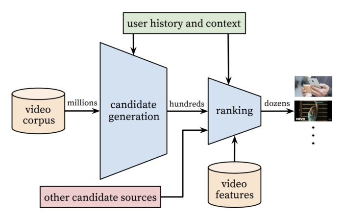
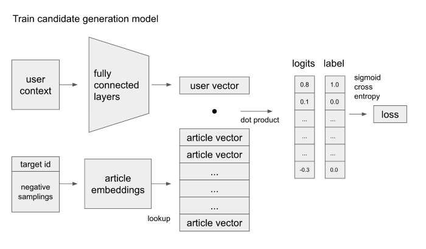

# Recommendation System Developing 👨‍💻

Source/Reference: [당근마켓 - 딥러닝 개인화 추천](https://medium.com/daangn/%EB%94%A5%EB%9F%AC%EB%8B%9D-%EA%B0%9C%EC%9D%B8%ED%99%94-%EC%B6%94%EC%B2%9C-1eda682c2e8c)

## Collaborative Filtering, Content-based Filtering and Matrix Factorization:thinking:

추천 시스템을 검색해보고 찾아보다 보면 주로 협업 필터링(Collaborative Filtering), 내용 기반 필터링(Content-based Filtering), 하이브리드 등 같은 솔루션들이 있습니다.

또한 CF를 구현하는 방법 중 행렬 분해(Matrix Factorization)로 구현된 라이브러리도 쉽게 찾을 수 있습니다.

하지만 이러한 솔루션들과 라이브러리만으로 실시간 개인화 추천 시스템을 구현하고 구축하기에는 다음과 같은 문제들이 발생합니다.

- 학습 데이터가 많아질 수록 메모리 사용량이 급격하게 증가하거나, 학습 속도가 느려짐
- 사용자 정보를 ID의 단일 값이 아닌 다양한 정보를 활용하기에 유연하지 않음
- 실시간으로 빠른 추천 구현에 대한 고려가 부족

그래서 실제로 서비스 중인 추천 시스템들에 대한 이해가 필요했고, 유튜브에서 공개한 논문과 핀터레스트에서 공개한 홈 피드 추천 시스템을 참고하여 개발을 했습니다.

## Deep Learning System :robot:

### Two-Stage

유튜브와 핀터레스트의 추천 시스템의 공통점은 2단계로 나누어져 있다는 점입니다.

사용자에게 추천할 후보군을 수백개 뽑는 1 단계 후보 모델, 그리고 그 수백개의 후보들이 사용자가 얼마나 관심을 가질지를 계산하는 2 단계 랭킹 모델이 있습니다.

Source: [Deep Neural Networks for YouTube Recommendations](https://static.googleusercontent.com/media/research.google.com/ko//pubs/archive/45530.pdf)

이렇게 2 단계로 구성되어져 이유는 추천할 대상이 많아 사용자가 모든 글에 대한 관심 점수를 계산하기에는 너무 오래 걸리기 때문에 추천할 후보를 대략적으로 빠르게 선별한 후 랭킹 점수를 계산하여 재 정렬하는 것 입니다.

### 후보 모델

